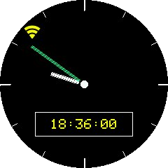
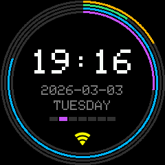
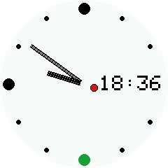
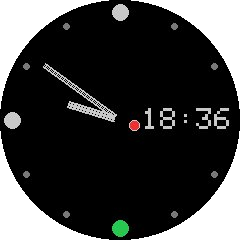

# ESP32 WiFi Clock

A WiFi-connected clock built on an ESP32 with a 1.28-inch circular TFT display. Time is synchronized via NTP and the timezone is configurable through a web portal. The project is buildable with both Arduino IDE and PlatformIO.

---

## Hardware

### Components

- ESP32 development board (dual-core, 240MHz)
- DIYables 1.28-inch Round Circular TFT LCD Display (GC9A01, 240x240, IPS, SPI)

### Display specification

| Property | Value |
|---|---|
| Display size | 1.28 inches (diagonal) |
| Resolution | 240 x 240 pixels |
| Display type | IPS TFT LCD |
| Driver IC | GC9A01 |
| Interface | 4-wire SPI |
| Operating voltage | 3.3V - 5V |
| Color depth | 65K RGB (16-bit) |
| Active area | 32.4mm diameter (circular) |

### Wiring

| Display pin | ESP32 GPIO |
|---|---|
| VCC | 3.3V |
| GND | GND |
| SCL (SCLK) | GPIO 18 |
| SDA (MOSI) | GPIO 23 |
| CS | GPIO 26 |
| DC | GPIO 25 |
| RST | GPIO 27 |

The BOOT button (GPIO 0) built into the ESP32 development board is used for user interaction. No additional hardware is required.

---

## Software dependencies

| Library | Author | Purpose |
|---|---|---|
| DIYables_TFT_Round | DIYables.io | TFT display driver |
| WiFiManager | tzapu | WiFi configuration portal |
| OneButton | Mathias Hertel | Button debounce and gesture detection |
| TzDbLookup | anonymousaga | IANA to POSIX timezone conversion |

---

## Building and flashing

### Arduino IDE

1. Install the libraries listed above via **Sketch -> Include Library -> Manage Libraries**
2. Open the `ESP32C3-Clock/` folder as a sketch
3. Select your ESP32 board under **Tools -> Board**
4. Select the correct COM port under **Tools -> Port**
5. Click **Upload**

### PlatformIO

1. Open the repository root folder in VS Code with the PlatformIO extension installed
2. PlatformIO will read `platformio.ini` and install all dependencies automatically
3. Click **Build** then **Upload** from the PlatformIO toolbar, or run `pio run -t upload` from the terminal

### Screenshot mode

Screenshot mode is a special build configuration that renders a clock face to a BMP image and serves it over HTTP.
It is useful for capturing reference images of each clock face without needing a camera.

To enable it, set the build flags in `platformio.ini`:
```ini
build_flags =
  -DSCREENSHOT_MODE=1
  -DSCREENSHOT_FACE=CLOCK_FACE_ORBIT
  -DSCREENSHOT_YEAR=2026
  -DSCREENSHOT_MONTH=3
  -DSCREENSHOT_DAY=19
  -DSCREENSHOT_HOUR=10
  -DSCREENSHOT_MIN=10
```

`SCREENSHOT_FACE` accepts any value from the `ClockFaceType` enum in `clock_face_factory.h`. The hardcoded time displayed on the face is set in `ESP32C3-Clock.ino` and `display.cpp` and can be adjusted there before building.

The time displayed on the face is controlled by `SCREENSHOT_YEAR`, `SCREENSHOT_MONTH` (1-based), `SCREENSHOT_DAY`, `SCREENSHOT_HOUR`, and `SCREENSHOT_MIN`. These default to 2026-03-19 at 10:10 if not overridden.

WiFi/NTP, the startup screen, and button handling are all disabled in this mode. The device connects using previously saved WiFi credentials and starts an HTTP server. Once it prints the IP address to the serial console, navigate to: `http://<device-ip>/screenshot`

The response is a 240×240 BMP file. The image is rendered in 16-row strips due to heap constraints, so the request takes several seconds to complete. After downloading, restore the normal build by setting `SCREENSHOT_MODE=0` and flashing again.

---

## Configuration

On first boot the device starts a WiFi access point named `ESP32-Clock` with password `clocksetup`. Connect to it from any device and a configuration portal will open automatically (or navigate to `192.168.4.1`).

The portal allows you to configure:

- **WiFi network** — SSID and password of your home network
- **Timezone** — select from a structured dropdown organized by continent. The selected value is stored as a POSIX timezone string and applied to NTP time synchronization
- **NTP server** — defaults to `pool.ntp.org`. Can be changed to any NTP server hostname

Configuration is saved to non-volatile storage and survives power cycles. The portal reopens automatically if the saved WiFi network becomes unreachable for an extended period.

---

## Button reference

The BOOT button (GPIO 0) built into the ESP32 development board supports two interactions after the startup phase is complete.

You can force an immediate NTP time synchronization by double-clicking the button. This is useful when you suspect the displayed time has drifted or after a long period without network connectivity.

You can reset all saved configuration by holding the button for 5 seconds until the display shows a confirmation prompt, then double-clicking to confirm. This erases the stored WiFi credentials, timezone, and NTP server settings and restarts the device into first-time setup mode. If you do not confirm within 30 seconds the device cancels the reset and returns to normal operation automatically.

---

## Power saving

Power save mode reduces energy consumption by disabling the Bluetooth radio permanently and turning off the WiFi radio between NTP synchronizations.

### Bluetooth

Bluetooth is disabled unconditionally at startup since the project does not use it. This is a one-time call during `setup()` and requires no configuration.

### WiFi power save mode

When enabled, the WiFi radio is turned off shortly after each successful NTP sync and brought back up only when the next sync is due. The device keeps accurate time between syncs using the ESP32's internal RTC, which continues running with the radio off.

The device status reflects this with a dedicated `SYNCED_WIFI_OFF` state. Clock faces treat this state as normal operation — no error icons are shown.

This option can be toggled in the WiFi configuration portal under **Power safe mode. Disable networking when not needed**. It defaults to enabled and is saved to non-volatile storage alongside the other settings.

### Power save timing constants

| Constant | Default | Description |
|---|---|---|
| `WIFI_OFF_AFTER_SYNC_MS` | 60000ms | How long WiFi stays on after a successful sync before being turned off |
| `NTP_SYNC_DELAY_MS` | 30000ms | How long to wait after WiFi reconnects before attempting NTP sync, allowing the connection to stabilize |

Both constants are defined in `timing_constants.h`.

### Timing constants

Button timing can be adjusted in `timing_constants.h` if your hardware requires it. Physical buttons vary in their bounce characteristics between boards and components:

| Constant | Default | Description |
|---|---|---|
| `BUTTON_DEBOUNCE_MS` | 40ms | Ignore state changes shorter than this after a press |
| `BUTTON_CLICK_MS` | 400ms | Maximum time between clicks to register as double click |
| `LONG_PRESS_TIME_MS` | 5000ms | Hold duration required to trigger reset-pending |
| `RESET_TIMEOUT_MS` | 30000ms | Time allowed to confirm reset before cancelling |

---

## Architecture

### FreeRTOS tasks

The firmware runs four concurrent tasks:

| Task | Core | Description |
|---|---|---|
| Main loop (Arduino) | Core 1 | Button polling and display redraw every 400ms |
| StartupScreen | Core 1 | Drives the startup animation, terminates itself when initialization is complete |
| NtpTask | Core 0 | Checks for pending or scheduled NTP sync every 10 seconds |
| WifiMonitor | Core 0 | Checks WiFi connection status every 30 seconds, attempts reconnection if disconnected |

The display is protected by a mutex. Any task that writes to the display must acquire it first via `takeDisplayMutex()` and release it via `giveDisplayMutex()`.

### ClockFace pattern

The display output is abstracted behind a `ClockFace` interface defined in `clock_face.h`:

```cpp
class ClockFace {
public:
  virtual void draw(AppState state, bool blinkState, tm timeinfo) = 0;
  virtual void reset() = 0;
  virtual ~ClockFace() {}
};
```

`redrawDisplay()` in `display.cpp` calls the active face's `draw()` method on every tick, passing the current app state and a blink signal that toggles every 400ms. The face is responsible for deciding what to draw based on those inputs.

The active face is set via `setClockFace()` and retrieved from the factory:

```cpp
setClockFace(getInstance(CLOCK_FACE_CLASSIC));
```

### Available clock faces

| `ClockFaceType` | Description |
|---|---|
| `CLOCK_FACE_CLASSIC` | Traditional analog clock with hour and minute hands, tick marks, and a digital seconds readout |
| `CLOCK_FACE_ORBIT` | Concentric arcs showing year/month/day/minute progress with large digital time and date |
| `CLOCK_FACE_BAUHAUS_LIGHT` | Bauhaus-inspired analog face, light theme |
| `CLOCK_FACE_BAUHAUS_DARK` | Bauhaus-inspired analog face, dark theme |
| `CLOCK_FACE_BAUHAUS_AUTO` | Switches automatically between light and dark Bauhaus themes at 07:00 and 19:00 |






### Implementing a new clock face

1. Create `clock_face_yourname.h` and `clock_face_yourname.cpp`
2. Inherit from `ClockFace` and implement `draw()` and `reset()`

```cpp
// clock_face_yourname.h
#ifndef CLOCK_FACE_YOURNAME_H
#define CLOCK_FACE_YOURNAME_H

#include "clock_face.h"
#include "app_state.h"

class ClockFaceYourName : public ClockFace {
public:
  void draw(AppState state, bool blinkState, tm timeinfo) override;
  void reset() override;
};

#endif
```

3. Add a new entry to the `ClockFaceType` enum in `clock_face_factory.h`:

```cpp
enum ClockFaceType {
  CLOCK_FACE_CLASSIC,
  CLOCK_FACE_YOURNAME,
};
```

4. Add a static instance and a case to `getInstance()` in `clock_face_factory.cpp`:

```cpp
#include "clock_face_yourname.h"

static ClockFaceClassic classicFace;
static ClockFaceYourName yourNameFace;

ClockFace* getInstance(ClockFaceType type) {
  switch (type) {
    case CLOCK_FACE_YOURNAME: return &yourNameFace;
    case CLOCK_FACE_CLASSIC:
    default:                  return &classicFace;
  }
}
```

5. Switch to the new face in `ESP32C3-Clock.ino`:

```cpp
setClockFace(getInstance(CLOCK_FACE_YOURNAME));
```

The `reset()` method is called automatically when returning from a full-screen overlay (reset confirmation or WiFi setup instructions). Use it to set any internal `_needsFullRedraw` flags your face uses to trigger a complete background repaint.

### Key configuration constants

| File | Constant | Description |
|---|---|---|
| `timing_constants.h` | `BLINK_INTERVAL_MS` | Display redraw interval and startup spinner framerate |
| `timing_constants.h` | `NTP_SYNC_INTERVAL_MS` | How often the NTP task triggers an automatic time sync |
| `timing_constants.h` | `RECONNECT_INTERVAL_MS` | Minimum time between WiFi reconnection attempts |
| `timing_constants.h` | `WIFI_MONITOR_CHECK_INTERVAL_MS` | How often the WiFi monitor checks connection status |
| `pins.h` | `PIN_RST`, `PIN_DC`, `PIN_CS` | Display SPI control pins |
| `pins.h` | `BOOT_BUTTON_PIN` | GPIO pin for the user button |
| `config.cpp` | `WIFI_HOTSPOT_SSID` | Access point name shown during first-time setup |
| `config.cpp` | `WIFI_HOTSPOT_PASSWORD` | Access point password during first-time setup |
